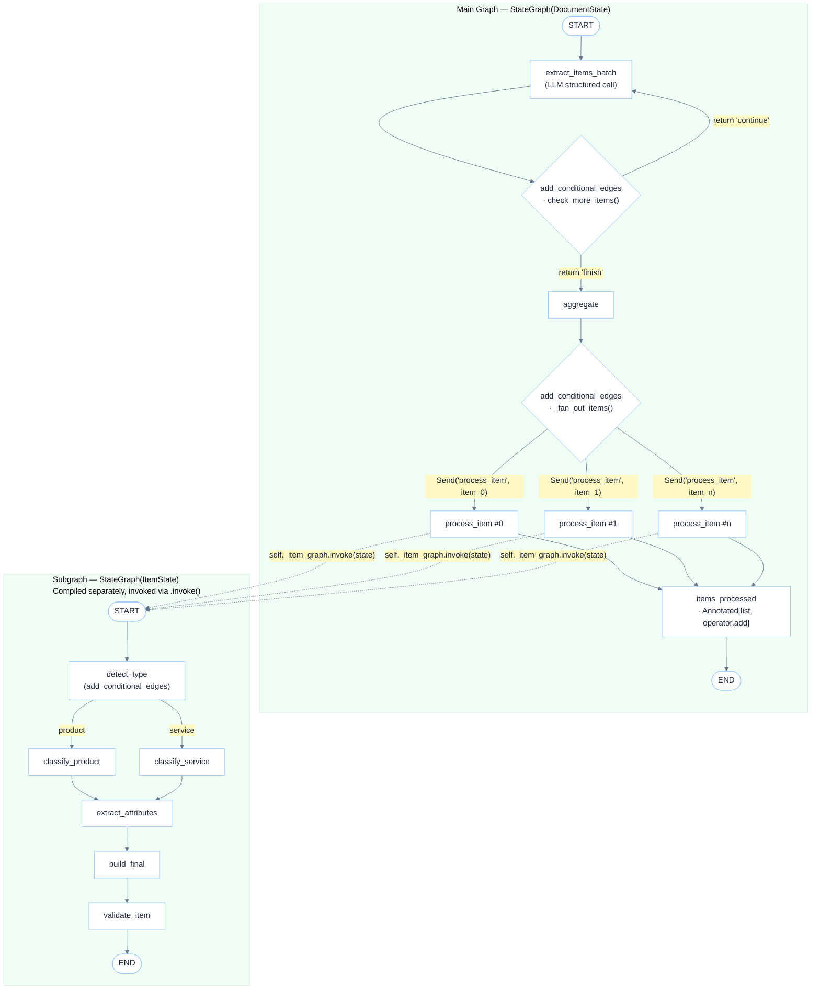

# langgraph-extract-items

```
██╗     █████╗ ███╗   ██╗ ██████╗  ██████╗ ██████╗  █████╗ ██████╗ ██╗  ██╗
██║    ██╔══██╗████╗  ██║██╔════╝ ██╔════╝ ██╔══██╗██╔══██╗██╔══██╗██║  ██║
██║    ███████║██╔██╗ ██║██║  ███╗██║  ███╗██████╔╝███████║██████╔╝███████║
██║    ██╔══██║██║╚██╗██║██║   ██║██║   ██║██╔══██╗██╔══██║██╔═══╝ ██╔══██║
██████╗██║  ██║██║ ╚████║╚██████╔╝╚██████╔╝██║  ██║██║  ██║██║     ██║  ██║
╚═════╝╚═╝  ╚═╝╚═╝  ╚═══╝ ╚═════╝  ╚═════╝ ╚═╝  ╚═╝╚═╝  ╚═╝╚═╝     ╚═╝  ╚═╝
                        extract  ·  classify  ·  enrich
```

[](https://www.python.org/)
[](https://langchain-ai.github.io/langgraph/)
[](https://mistral.ai/)
[](https://langfuse.com/)
[](LICENSE)

A **LangGraph Map-Reduce pipeline** that extracts, classifies, and enriches procurement items from Portuguese public-sector documents (Termos de Referência, Editais).

---

## Overview

Given a raw document text the pipeline:

1. **Extracts** all items iteratively (batch-by-batch) using a structured LLM call
2. **Fans out** every item in parallel via LangGraph's `Send` API
3. **Classifies** each item as *product* or *service*, then assigns a fine-grained category class
4. **Enriches** each item with structured attributes (quantity, unit price, total value, metadata)
5. **Validates** and assembles the final normalized record

All steps are traced end-to-end in **Langfuse** with span-level observability.

---

## Architecture



### LangGraph Patterns Used

#### 1. Evaluator Loop — `add_conditional_edges`

<p align="center">
  
</p>

The extraction node loops until the LLM signals there are no more items. LangGraph's `add_conditional_edges` maps the return value of `check_more_items()` to either re-enter the same node (`"continue"` &rarr; `extract_items_batch`) or move forward (`"finish"` &rarr; `aggregate`). A safety cap of 15 iterations prevents infinite loops.


#### 2. Orchestrator-Workers — `Send` API + Subgraph

<p align="center">
  
</p>

After aggregation, each raw item is dispatched to its own `process_item` worker **in parallel** via `Send`. LangGraph spawns one independent execution per `Send` object, each carrying its own `ItemState`. Every worker invokes a **compiled subgraph** (`StateGraph(ItemState)`) that runs the full classification pipeline independently.


Results from all parallel workers are automatically merged back into `DocumentState.items_processed` using `operator.add` as the reducer — LangGraph's built-in mechanism for collecting outputs from fan-out nodes.


#### 3. Routing — `add_conditional_edges` inside the Subgraph

<p align="center">
  
</p>

Inside each worker's subgraph, the `detect_type` node routes the item to the appropriate classifier based on its type. LangGraph's `add_conditional_edges` evaluates the detected type and sends the item down the correct branch — `classify_product` or `classify_service` — before converging back at `extract_attributes`.


## Project Structure

```
langgraph-extract-items/
├── pipeline.py                  # ItemExtractionPipeline (entry point)
├── test_pipeline.py             # Standalone integration tests
├── requirements.txt
├── .env.example
└── src/
    ├── config/
    │   ├── settings.py          # Env var loader
    │   └── mistral_client.py    # Thin LLM wrapper
    ├── utils/
    │   ├── schemas.py           # Pydantic output models
    │   ├── state.py             # DocumentState + ItemState (TypedDict)
    │   ├── constants.py         # Product/service class lists
    │   ├── classifiers.py       # TypeDetector, ProductClassifier, ServiceClassifier
    │   ├── extractors.py        # ItemExtractor (iterative batch)
    │   └── enrichers.py         # AttributeExtractor
    ├── nodes/
    │   ├── extraction.py        # extract_items_batch_node, aggregate, check_more_items
    │   ├── classification.py    # detect_type_node, classify_product_node, classify_service_node
    │   └── transformation.py    # extract_attributes_node, build_final_item_node, validate_item_node
    └── prompts/
        ├── __init__.py          # PromptLoader (parses ## System / ## User sections)
        ├── detect_type.md
        ├── classify_product.md
        ├── classify_service.md
        ├── extract_items.md
        ├── extract_items_batch_first.md
        ├── extract_items_batch_next.md
        └── extract_attributes/
            ├── product/general.md
            └── service/general.md
```

## Item Schema

Each processed item in `items_processed` contains:

```python
{
    "id": "item_1_0",
    "document_id": 1,
    "name": "Resma de Papel A4",
    "type": "product",            # "product" | "service"
    "value": "11000.00",
    "description": "...",
    "metadata": "{...}"           # JSON string with full ItemMetadata
}
```
